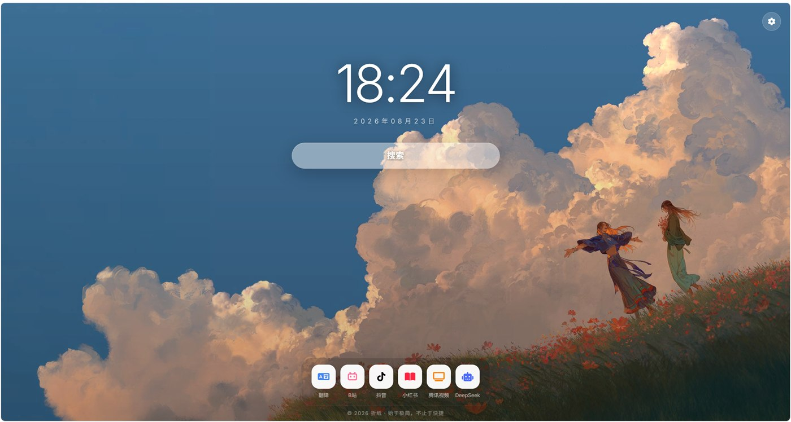

# 折纸起始页

> 个人浏览器起始页 / 新标签页。纯前端单文件，双击 `index.html` 即可使用。
> 「在朦胧光影中，让每一次搜索与跳转，都成为一场极简的日常仪式。」

## 效果预览



---


## 一、技术栈与依赖

| 项 | 说明 |
|------|------|
| 形态 | **纯前端单页**，全部代码内嵌在 `index.html`（HTML + CSS + JS） |
| CSS 框架 | **Tailwind CSS**（CDN，内联 config 开启 `darkMode: 'class'`）负责布局；深度细节用自定义 `<style>` |
| 图标库 | **Font Awesome 6**（CDN）+ **Lucide**（自托管 `lucide.min.js`，用于新建站点/图标） |
| 字体 | Google Fonts：`Inter`（拉丁）+ `Noto Sans SC`（中文） |
| 存储 | 浏览器 `localStorage`（主题 / 亮度 / 透明度 / 壁纸 / 搜索引擎 / 底部导航 / 引擎偏好 / 翻译历史 等） |
| 联想 | **JSONP**（注入 `<script>` 绕过 CORS），调用各搜索引擎联想接口 |

> Lucide 从 CDN 下载后自托管（`lucide.min.js` 放在站点根，`<script src="lucide.min.js">` 本地引用），离线可用。搜索框左侧可切换**多个搜索引擎**。

---

## 二、目录结构

```
折纸起始页/
├── index.html        # 起始页（结构 + 样式 + 脚本 全在此）
├── translate.html    # 翻译页（Google 免费 / AI 大模型 / 腾讯 TMT）
├── lucide.min.js     # Lucide 图标库（自托管，不依赖 CDN）
├── favicon.svg       # 站点图标（彩纸千纸鹤）
├── screenshot.jpg    # 效果预览图（本文档顶部展示）
├── README.md         # 本文档（对公开仓库）
├── wallpapaer/       # 壁纸资源（5 张完整背景 + 5 张缩略图）
│   ├── bg-zp5z2w.jpg        # 默认壁纸（压缩后的完整背景图）
│   ├── wp-*.jpg             # 其余壁纸的「完整背景图」
│   └── tb-*.jpg             # 各壁纸的「缩略图」（设置面板预览）
└── _deploy/          # 仅本地使用，不进公开仓库（.gitignore 忽略）
    ├── site/         # 部署暂存目录（deploy_zz.py 整体打包上传）
    └── deploy_zz.py  # 一键部署脚本（paramiko，含服务器信息）
```

> `DEPLOY.md`（部署运维详版，含服务器 IP/路径/Nginx）仅存在本地，不进公开仓库；其公开部分已整合进本 README。

> 运行页面只引用 `wp-*` / `bg-*` 与 `tb-*`，不加载原始 PNG。`_deploy/` 仅用于上线，本地双击 `index.html` 不会用到。

---

## 三、整体架构

页面自上而下三块区域，外加一个「背景层」和一个「设置面板」：

```
<body>
 ├─ <div id="bgLayer" class="bg-layer">          # 固定背景层：壁纸 + 压暗 + 亮度滤镜
 ├─ 右上角设置 (settingsBtn + settingsPanel)      # 显示/搜索引擎/壁纸/底部导航
 ├─ <main>                                        # 中央主区
 │   ├─ 时钟 (#clock) + 日期 (#date)
 │   └─ 搜索表单 (#searchForm)
 │        ├─ 搜索胶囊 (.search-pill)              # 引擎按钮 | 输入框 | 放大镜
 │        ├─ 引擎下拉 (#engineMenu)
 │        └─ 搜索联想下拉 (#suggestMenu)
 ├─ <span id="toast">                            # 轻提示
 ├─ 底部图标坞 (#dock)                            # 快捷站点（JS 生成，可隐藏/排序/删除）
 └─ <footer>                                      # 备案
```

### 关键设计决策

1. **背景独立成层**：背景放 `.bg-layer`（`z-index:-1`），`body` 背景透明。这样「亮度滑块」用 `filter: brightness(var(--brightness))` 只作用于壁纸，不影响文字。
2. **搜索胶囊用 `::before` 承载半透明底色**：`background: var(--pill-bg)` 配 `opacity: var(--search-opacity)`，于是「透明度滑块」能直接控制胶囊的实/透。
3. **引擎按钮 / 放大镜绝对定位**：`position:absolute` 覆盖在两侧，输入框始终全宽居中，保证初始态与聚焦态的文字中心一致。
4. **共享 `.panel` 玻璃卡片基类**：引擎菜单、设置面板、联想下拉共用同一套毛玻璃样式，联想下拉通过 `.suggest-menu` 覆盖为更透明的变体。

---

## 四、设置面板（折叠卡片）

右上角齿轮打开设置面板，各部分为**独立可折叠卡片**：

| 卡片 | 内容 |
|------|------|
| **显示** | 外观（浅/深主题）、亮度、搜索框透明度 |
| **搜索引擎** | 列出全部引擎；**单击 = 设为当前**，**双击 = 编辑**，✕ = 删除，＋添加；颜色预设随机分配、用户不可选；默认必应 |
| **壁纸** | 内置 5 张 + **自定义壁纸**（本地图片压缩后保存，可删除，上限 8 张） |
| **底部导航** | 编辑站点内容/顺序；每站点可**单独隐藏/显示**（👁）；单击=编辑、删除；且有整条显示/隐藏 |

---

## 五、JS 组织（IIFE 内 9 个模块）

整个脚本包在 `(function(){ 'use strict'; … })()` 中，避免全局污染。模块顺序即初始化顺序：

| 模块 | 职责 |
|------|------|
| **工具** | `$`（按 id 取元素）、`clamp`、`store`（localStorage 封装）、`pad`、`beijingNow`（北京时间 UTC+8）、`bindRange`（滑块初始化）、`showToast`、`escapeHtml`、配置版本迁移 |
| **1 时钟** | 每秒刷新北京时间 `HH:MM` + 日期 |
| **2 主题** | 浅/深切换，`localStorage` 记忆 |
| **3 亮度 & 透明度** | 用 `bindRange` 复用同一套滑块逻辑 |
| **4 壁纸** | 内置 + 自定义壁纸，生成缩略图网格，点击切换背景，记忆 |
| **5 搜索引擎** | 内置 6 个 + 用户自定义，`ENGINES` 动态拼接；`Alt+1~6` 快捷键；智能导入网址 |
| **6 设置面板** | 开关设置面板 |
| **7 搜索 & 联想** | 提交跳转；JSONP 联想（跟随当前引擎）、上下键/回车/Esc |
| **8 图标坞** | `dockSites` 数组 → JS 生成快捷站点；加/删/排序/隐藏 |
| **9 全局交互** | 单次 `click` 关闭所有下拉；`keydown`（Alt+1~6、/、Esc） |

### 状态与存储键

| 存储键 | 含义 | 默认 |
|--------|------|------|
| `zz-theme` | 主题（light/dark） | light |
| `zz-brightness` | 背景亮度（0.6–1.4） | 1.2 |
| `zz-searchop` | 搜索框透明度（0.2–1） | 0.55 |
| `zz-wallpaper` | 当前壁纸 id | zp5z2w |
| `zz-custom-walls` | 自定义壁纸数组（base64 压缩图） | [] |
| `zz-engine` | 当前搜索引擎 | 必应 |
| `zz-engines` | 用户自定义搜索引擎数组 | [] |
| `zz-hidden-engines` | 被删除的内置引擎 id | [] |
| `zz-dock` | 底部导航站点数组（含每站点 hidden 状态） | 默认六项 |
| `zz-cfg-ver` | 配置版本号（用于一次性迁移旧默认值） | - |

---

## 六、搜索引擎（重点）

- **内置 6 个**：百度、必应、谷歌、Yandex、搜狗、360搜索。**默认必应**。
- **用户自定义**：可增删改（名称 / 网址 / 徽标 / 颜色）。颜色从预设随机分配，用户不可选。
- **智能导入网址**：添加/编辑搜索引擎时，**只需输入首页**（如 `https://www.baidu.com`），会自动补成带 `{q}` 占位的搜索 URL（内置常见搜索引擎模板，如 `baidu.com → https://www.baidu.com/s?wd={q}`）；未知站点则自动追加 `?q={q}`。
- **搜索提交**：`buildSearchUrl(e, q)`——URL 含 `{q}` 就替换成关键词，否则向后拼接（兼容旧数据）。
- **设为当前 / 删除**：单击行为当前；✕ 删除（内置删进隐藏列表、自定义直接移除）。

---

## 七、搜索联想（重点）

- **机制**：JSONP。为绕过 `file://` 打开的 `fetch` 的 CORS 限制，动态注入 `<script>` 并传入全局回调名 `window['__zzSuggN']`；接口返回后调用回调取词，随即清理脚本与回调。
- **跟随当前引擎**：`ENGINES` 按 `ENGINE_SUGGEST_SOURCE` 映射到对应联想源。
- **必应回退**：`api.bing.com` 已改为返回纯 JSON（不包 JSONP），故必应联想回退到**百度词库**。搜索跳转仍按当前引擎。
- **交互**：输入防抖；`↑/↓` 高亮；`Enter` 搜索高亮项；`Esc` 关闭；点击即搜。
- **失败静默**：接口报错 / 超时(3.5s) 时隐藏下拉，不影响搜索。

---

## 八、自定义指南

### 1. 加/删快捷站点（Dock）
改 JS 的 `DOCK_SITES` 数组（默认值），每项 `{ name, icon, color, url, hidden }`。`hidden: true` 表示默认隐藏。

### 2. 加/删内置壁纸
在 `wallpapaer/` 放入压缩图（`wp-xxx.jpg` 完整背景 + `tb-xxx.jpg` 缩略图），再在 JS 的 `BUILTIN_WALLS` 数组加一行 `{ id, name, full, thumb }`。

### 3. 加/删搜索引擎
改 JS 的 `BUILTIN_ENGINES` 数组（`id/name/badge/color/url/key`），并在 `SUGGEST_SOURCES` 加对应联想源、`ENGINE_SUGGEST_SOURCE` 加映射；`KNOWN_SEARCH` 加智能导入模板。

### 4. 调视觉参数
都在 `:root` / `html.dark` 变量里：背景压暗 `--overlay`、胶囊底色 `--pill-bg`、文字色 `--pill-text`、图标坞底色 `--dock-bg` 等。

---

## 九、运行 / 部署

### 本地运行
双击 `index.html` 即可（无需构建、无需后端；壁纸走相对路径，离线可用）。联网才能用搜索联想。

### 部署到静态托管
这是一个**纯静态站点**（含自托管 `lucide.min.js` + `favicon.svg`），放到任意静态托管即可：

- **Nginx / 任意静态服务器**：直接把 `index.html`、`translate.html`、`lucide.min.js`、`favicon.svg`、`wallpapaer/` 整目录上传到站点根即可，无需 Node/数据库。
- **GitHub Pages / 阿里云 OSS / 对象存储**：同样整体上传即可。

> 站点里除壁纸走相对路径外，无任何后端依赖；`translate.html` 为独立翻译页，可单独部署。

### 一键部署脚本
项目预置了 `_deploy/deploy_zz.py`（paramiko 一键打包上传）。**该脚本及其部署配置含服务器信息，默认不进仓库**（已被 `.gitignore` 忽略），本地自行使用：

```powershell
# 先把最新文件同步到 _deploy/site/，再执行：
python _deploy/deploy_zz.py <服务器密码>
```

脚本会：打包 `_deploy/site` → 上传 → 服务器解压到部署目录（备份旧目录后覆盖），输出 `DEPLOY_OK` 即成功。

### 推送到 GitHub
仓库即本目录。日常改动后：

```bash
git add -A
git commit -m "..." 
git push
```

> 注：`DEPLOY.md`（含服务器 IP、路径、Nginx 配置等运维信息）与 `_deploy/`（含密码脚本）**都不进公开仓库**，相关内容已整合进本 README。

---

## 十、说明

- 搜索联想依赖各引擎第三方接口的可用性；不同网络环境下某些引擎可能无联想（属外部限制，不影响搜索）。
- 页面未接入任何前端构建工具（无打包），便于直接改源码。
- 翻译页 `translate.html` 为独立页面，可单独部署/使用。
- 自定义壁纸/搜索引擎/底部导航均保存在浏览器 `localStorage`，各浏览器独立，不清除浏览器数据则不丢失。
